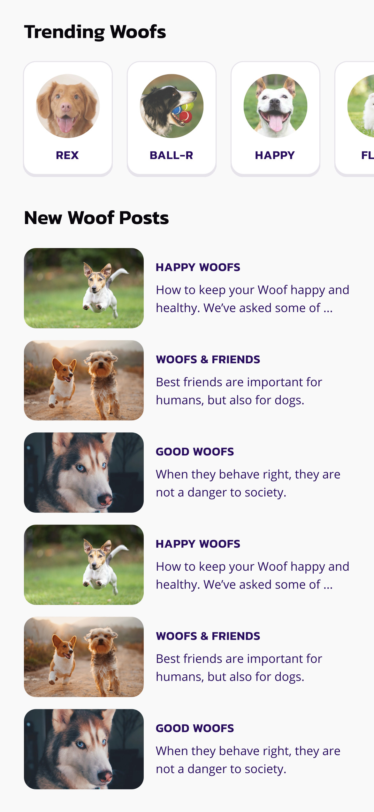

# Make an Instagram App (Part Two)
Project from Codecadmy to help practice React Native skills.
Without a good UI, even an up-and-coming app like Woofstagram won't attract any users!

This project continues on our previous Woofstagram Sign-up Form, the Instagram for your dogs. We're building the home screen for Woofstagram, with both visual and structural components.

While going through this project, pay attention to both the code you are writing and the overall styling process: this will help you in future, more complex projects.

One important part of the process is creating reusable components to display app-specific content. It enables us to build flexible, extendable, and visually consistent apps.

Another part of the process, before creating an app, is thinking about the content and features we want to present to users. This not only helps us keep track of our progress, but also helps us structure the components.

## Implementation Details

### Component Architecture
The app is built with reusable, modular components:
- **Avatar**: Circular image component with error handling for profile pictures
- **Heading**: Large section headers (24px, bold)
- **Title**: Centered text component for dog names (18px, bold)
- **WoofCard**: Card-based display for trending dogs with avatar and name
- **WoofPost**: Horizontal layout combining article image thumbnail with title and description

### Styling Approach
- **Color Scheme**: Light, modern design with white cards (#FFFFFF) on a subtle lavender background (#FAF9FA)
- **Typography**: System font family with clear hierarchy for readability
- **Card Styling**: 
  - 8px border radius for smooth corners
  - Cross-platform shadows using iOS-specific properties (shadowColor, shadowOffset, shadowOpacity, shadowRadius) with Android elevation fallback (elevation: 5)
  - Consistent padding and margins for spacing
- **Layout Details**: 
  - WoofPost uses flexbox row layout with flex ratio (1:2) — image takes flex: 1, content takes flex: 2 for responsive thumbnail-to-content proportion
  - Text truncation with numberOfLines={2} for post descriptions ensures consistent card sizing
- **Responsive Design**: Circular avatars with 50px border radius, responsive spacing using flexbox and padding

### Performance Optimization
Instead of using `ScrollView`, the implementation uses `FlatList` for both sections:
- **Trending Woofs**: Horizontal `FlatList` for efficient horizontal scrolling
- **New Woof Posts**: Vertical `FlatList` for the article feed
This approach provides better performance and memory efficiency when dealing with large lists of data.

### SafeArea Handling
Uses `SafeAreaProvider` and `SafeAreaView` to ensure content displays properly across all device types and orientations.
